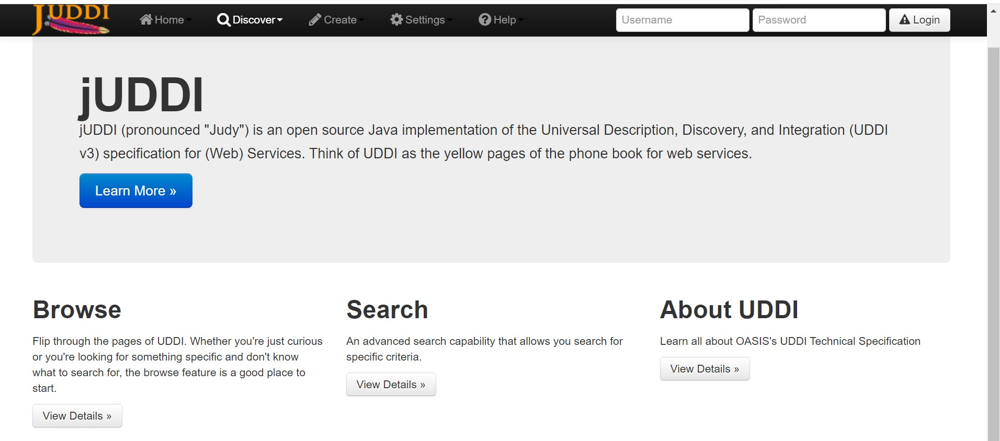

# 服务计算 juddi实验
## 环境
- jdk=1.8(1.6+), maven=3.0.4, juddi=3.3.4
## 部署
1.  进入<http://archive.apache.org/dist/juddi/juddi/3.3.4/>下载 __juddi-distro-3.3.4.zip（or tar.gz）__，解压到本地 
   
2.  使用内置tomcat，为其配置环境变量
   - 拷贝 your/path/juddi-distro-3.3.4/juddi-tomcat-3.3.4
   - 打开环境变量页面，添加系统变量名 __CATALINA_HOME__，将拷贝路径作为变量值
   - path选项中添加 __CATALIAN_HOME\bin__
   
   - 启动tomcat
   

- 考虑github的guisu，没有将用到的工具上传，建议还是自己找吧，需要的话可以给个网盘链接
- jdk=1.8
- maven=3.0.4
- juddi=3.3.4
- juddi这玩意儿对版本比较敏感，建议不要浪费太多时间在试错上了:)
- jdk、maven、juddi绑定的tomcat，该配置的环境变量都配置好吧 JAVA_HOME/MAVEN_HOME/CATALINA_HOME/CATALINE_BASE
- 注意tomcat用的是juddi中绑定的，具体路径：juddi-distro-3.3.4/juddi-tomcat-3.3.4
## Usage
- 配置没问题的话,启动tomcat ___startup.bat run___
- 打开localhost:8080地址，不出意外的话出现下面画面

- 点击Administration Interface,不出意外的话
  
  这个地方一定要注意最下面的Status信息栏，保证juddi的确已经成功安装
- 点击user Interface,不出意外的话
  
  
## GUI & juddi API
- Help-User's Guide介绍了GUI和几个简单的API demo，其中API demo存放路径在 __juddi-distro-3.3.4/examples__
