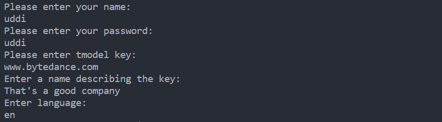

This example creates a new UDDI partition. 

1. Start the jUDDI-server (juddi-tomcat or juddi-bundle)

2. Check the settings of the __META-INF/uddi.xml__, to make sure the __serverName__ and __serverPort__ are set correctly.

3. `mvn -q -Pdemo test`

4. output:
   
   <!--  -->
   

      
   

