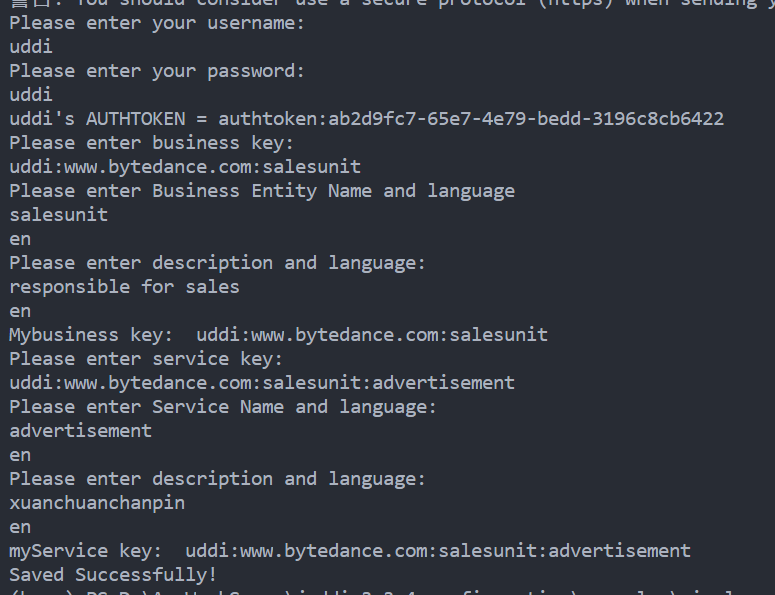

1. Start the jUDDI-server (juddi-tomcat or juddi-bundle)

2. Check the settings of the META-INF/uddi.xml, to make sure the serverName and serverPort are set correctly.

3. `mvn -q -Pdemo test`

4. output:
   

